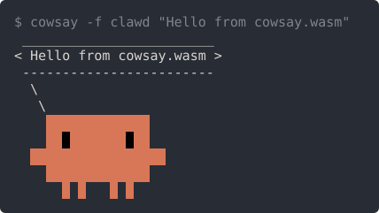

# cowsay.wasm

cowsay 3.03 (c) 1999-2000 Tony Monroe, reimplemented in C for `wasm32-wasip1`.

The popular wasm build of cowsay is [a Rust clone](https://github.com/wapm-packages/cowsay).
It weighs 700+ kB, and its cow has a broken leg.

This one stays under 100 kB, and its cow stands straight.
It prints exactly what [the original](https://github.com/tnalpgge/rank-amateur-cowsay) prints.

```console
$ echo moo | wasmtime run cowsay.wasm
 _____ 
< moo >
 ----- 
        \   ^__^
         \  (oo)\_______
            (__)\       )\/\
                ||----w |
                ||     ||
```

## Building

```console
$ make               # cowsay.wasm, needs WASI_SDK_PATH and optionally wasm-opt
$ make cowsay-native # host binary, same behavior, used by the tests
$ make check         # the differential test suite in both modes
$ make check-native  # only the host binary, against the vendored reference
$ make check-wasm    # only cowsay.wasm, under wasmtime
$ make lint          # shellcheck the scripts, and compile-check the Perl generator
```

## Behavior

For ASCII input, stdout, stderr and the exit code are identical to cowsay 3.03 under a modern Perl.
The only exceptions are four deliberate fixes for bugs of the original.
Non-ASCII input, meanwhile, counts Unicode codepoints where the original counts bytes.
A UTF-8 sequence is therefore never split in the middle.
For the full specification, and the suite that enforces it, see [test/README.md](test/README.md).

## Cowfiles

The binary embeds the 47 `.cow` files of cowsay 3.03, plus our own `clawd`, a Claude Code crab.
That way `-f name` and `-l` work without any filesystem access at all.

Unlike the plain-text cowfiles of the original, `clawd` is drawn with ANSI truecolor escapes.
They pass through to the output, so a pipe or a file gets them too.



Setting `COWPATH` switches to real directories instead, under the original's search rules.
Those look for `dir/name` first, then for `dir/name.cow`.
Under a wasm runtime, such a directory needs a preopen:

```console
$ wasmtime run --dir cows --env COWPATH=cows cowsay.wasm -f moose
```

A `-f` value containing `/` always reads the real filesystem.

A cowfile is a Perl script, but this implementation reads a restricted grammar of it instead.
[test/README.md](test/README.md) states that grammar in full, and anything outside it is refused.

## `cowthink`

Like the original, thought bubbles are selected by the program name.
So an invocation path containing `think`, in any case, switches to `cowthink`.

```console
$ cp cowsay.wasm cowthink.wasm && echo moo | wasmtime run cowthink.wasm
```

## License

GPL-3.0-only, the license of cowsay 3.03.
The cowfiles under `cows/` and the script under `test/reference/` are taken from it unmodified.
