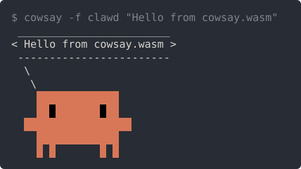

# cowsay.wasm

[cowsay 3.8.4](https://github.com/cowsay-org/cowsay), reimplemented in C for `wasm32-wasip1`.
cowsay is (c) 1999-2000 Tony Monroe, and cowsay-org maintains it since.

The popular wasm build of cowsay is [a Rust clone](https://github.com/wapm-packages/cowsay).
It weighs 700+ kB for a program that prints a cow.
That cow also has [broken legs](https://x.com/make_now_just/status/2100555120329347437).

This one stays under 100 kB, and its cow stands straight.
It prints exactly what cowsay 3.8.4 prints.

```console
$ echo moo | wasmtime run cowsay.wasm
 _____
< moo >
 -----
        \   ^__^
         \  (oo)\_______
            (__)\       )\/\
                ||----w |
                ||     ||
```

## Building

The tests read third-party cowfiles from submodules.
Run `git submodule update --init` once after cloning.

[mise.toml](mise.toml) pins wasi-sdk, binaryen, wasmtime and shellcheck, each with the SHA-256 of its release.
`mise install` puts them in your shell, and CI installs the same ones.
Without mise, point `WASI_SDK_PATH` at a wasi-sdk and have `wasm-opt` and `wasmtime` on your `PATH`.

```console
$ make               # cowsay.wasm, needs wasi-sdk and optionally wasm-opt
$ make cowsay-native # host binary, same behavior, used by the tests
$ make check         # the differential test suite in both modes
$ make check-native  # only the host binary, against the reference
$ make check-wasm    # only cowsay.wasm, under wasmtime
$ make check-size    # cowsay.wasm is under the 100 kB stated above
$ make check-third-party-cows # every third-party cowfile of test/submodules
$ make lint          # shellcheck the scripts, and compile-check the Perl generator
$ make update-ucd    # the only networked step: refresh ucd/ at UNICODE_VERSION
```

## Behavior

For ASCII input, stdout, stderr and the exit code are identical to cowsay 3.8.4 under a modern Perl.
The only exceptions are intended fixes for bugs of the original.
Non-ASCII input, meanwhile, is measured in terminal columns rather than bytes.
Grapheme clusters stay whole, East Asian and emoji characters take two columns,
and an ANSI colour survives a wrapped line.
For the full specification, and the suite that enforces it, see [test/README.md](test/README.md).

## Cowfiles

The binary embeds the `.cow` files of cowsay 3.8.4, plus our own `clawd`, a Claude Code crab.
That way `-f name` and `-l` work without any filesystem access at all.

Unlike the plain-text cowfiles of the original, `clawd` is drawn with ANSI truecolor escapes.
They pass through to the output, so a pipe or a file gets them too.



`-f` takes a file of that name first.
Otherwise it searches the built-in cowfiles, then each directory of `COWPATH`, as cowsay 3.8.4 does.
Each one is searched for `name`, then for `name.cow`.
`COWSAY_ONLY_COWPATH=1` leaves the built-in cowfiles out.
Under a wasm runtime, a directory needs a preopen:

```console
$ wasmtime run --dir my-cows --env COWPATH=my-cows cowsay.wasm -f my-cow
```

A cowfile is a Perl script, but this implementation reads a restricted grammar of it instead.
[test/README.md](test/README.md) states that grammar in full, and anything outside it is refused.

## `cowthink`

Like the original, thought bubbles are selected by the program name.
So an invocation path containing `think`, in any case, switches to `cowthink`.

```console
$ cp cowsay.wasm cowthink.wasm && echo moo | wasmtime run cowthink.wasm
```

## License

GPL-3.0-only, the license of cowsay.
The cowfiles under `cows/`, other than `clawd`, are taken from cowsay 3.8.4 unmodified.
